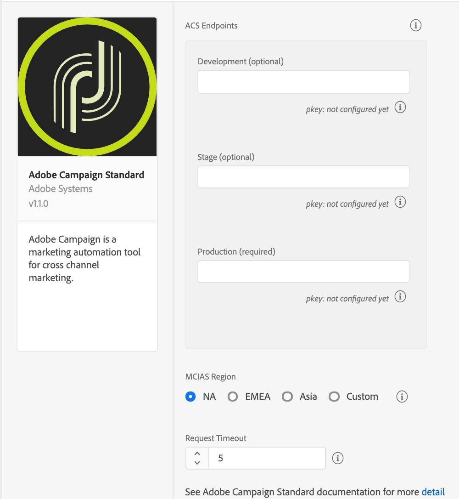

# Adobe Campaign Standard

Adobe Campaign is the Adobe Experience Cloud solution for cross channel campaign management. Learn how to use rich customer data to create, coordinate, and deliver dynamic campaigns — through email, mobile, offline channels, and more.

## Configure the Campaign Standard extension in the Data Collection UI

1. In the Data Collection UI, select the **Extensions** tab.
2. On the **Catalog** tab, locate the **Adobe Campaign Standard** extension, and select **Install**.
3. Provide the extension settings.
4. Select **Save**.
5. Follow the publishing process to update SDK configuration.

### Configure the Campaign Standard extension



### Campaign Standard endpoints

Provide endpoint URL(s) for your Campaign Standard instances. You can specify up to three unique endpoints for your development, staging, and production environments. In most cases, the server endpoint is the root URL address, such as `companyname.campaign.adobe.com`.

> **Warning**
> For this extension, endpoint URLs **do not** contain the scheme (`http://` or `https://`) and **cannot** end with a forward slash.

#### pKey

A unique, automatically generated identifier for a mobile app that was configured in Adobe Campaign Standard. After you configure this extension in the Data Collection UI, configure your mobile property in Campaign Standard. For more information, please read the tutorial on [configuring a mobile application in Adobe Campaign](https://experienceleague.adobe.com/docs/campaign-standard/using/administrating/configuring-channels/configuring-a-mobile-application.html).

After the configuration is successful in Campaign, the pKey is automatically generated and configured in the Campaign extension for a successful validation.

#### MCIAS region

Select an MCIAS region based on your customer's location or enter a custom endpoint. The SDK retrieves all in-app messaging rules and definition payloads from this endpoint.

#### Request timeout

The request timeout is the time in seconds to wait for a response from the in-app messaging service before timing out. The default timeout value is 5 seconds, and the minimum timeout value is 1 second.

> The request timeout value must be a non-zero number.

## Add the Campaign Standard extension to your app

1. Add the Campaign Standard, Mobile Core, Identity, Lifecycle, Signal, and Profile extensions to your project using the app's Gradle file.

```java
implementation 'com.adobe.marketing.mobile:campaign:2.+'
implementation 'com.adobe.marketing.mobile:core:2.+'
implementation 'com.adobe.marketing.mobile:identity:2.+'
implementation 'com.adobe.marketing.mobile:lifecycle:2.+'
implementation 'com.adobe.marketing.mobile:signal:2.+'
implementation 'com.adobe.marketing.mobile:userprofile:2.+'
```

> **Warning**
> Using dynamic dependency versions is not recommended for production apps. Refer to this [page](https://github.com/adobe/aepsdk-core-android/blob/main/Documentation/GradleDependencies.md) for managing gradle dependencies.

2. Import the Campaign Standard, Mobile Core, Lifecycle, Signal, and Profile extensions in your application's main activity.

#### Java

```java
import com.adobe.marketing.mobile.Campaign;
import com.adobe.marketing.mobile.Identity;
import com.adobe.marketing.mobile.Lifecycle;
import com.adobe.marketing.mobile.MobileCore;
import com.adobe.marketing.mobile.Signal;
import com.adobe.marketing.mobile.UserProfile;
```

#### Kotlin

```kotlin
import com.adobe.marketing.mobile.Campaign
import com.adobe.marketing.mobile.Identity
import com.adobe.marketing.mobile.Lifecycle
import com.adobe.marketing.mobile.MobileCore
import com.adobe.marketing.mobile.Signal
import com.adobe.marketing.mobile.UserProfile
```

## Register the Campaign Standard extension with Mobile Core

Call the `setApplication()` method once in the `onCreate()` method of your main activity.

For example, your code might look like the following:

#### Java

```java
public class MainApp extends Application {
    private static final String APP_ID = "YOUR_APP_ID";

    @Override
    public void onCreate() {
        super.onCreate();

        MobileCore.setApplication(this);
        MobileCore.configureWithAppID(APP_ID);

        List<Class<? extends Extension>> extensions = new ArrayList<>();
        extensions.add(Campaign.EXTENSION);
        extensions.add(Identity.EXTENSION);
        extensions.add(Lifecycle.EXTENSION);
        extensions.add(Signal.EXTENSION);
        extensions.add(UserProfile.EXTENSION);
        MobileCore.registerExtensions(extensions, o -> {
            Log.d(LOG_TAG, "AEP Mobile SDK is initialized");
        });
    }

}
```

#### Kotlin

```kotlin
class MyApp : Application() {

    override fun onCreate() {
        super.onCreate()
        MobileCore.setApplication(this)
        MobileCore.configureWithAppID("YOUR_APP_ID")

        val extensions = listOf(Campaign.EXTENSION, Identity.EXTENSION, Lifecycle.EXTENSION, Signal.EXTENSION, UserProfile.EXTENSION)
        MobileCore.registerExtensions(extensions) {
            Log.d(LOG_TAG, "AEP Mobile SDK is initialized")
        }
    }

}
```

## Initialize the SDK and set up tracking

#### Set up in-app messaging

To learn how to create an in-app message using Adobe Campaign, see the [tutorial on preparing and sending an in-app message](https://experienceleague.adobe.com/docs/campaign-standard/using/communication-channels/in-app-messaging/preparing-and-sending-an-in-app-message.html).

If you are developing an Android application, to correctly display fullscreen in-app messages, add the Campaign Standard extension's `FullscreenMessageActivity` to your AndroidManifest.xml file:

```markup
<activity android:name="com.adobe.marketing.mobile.FullscreenMessageActivity" />
```

In addition to adding the `FullscreenMessageActivity`, a global lifecycle callback must be defined in your app's MainActivity to ensure the proper display of fullscreen in-app messages. To define the global lifecycle callback, see the [implementing global lifecycle callbacks section](https://developer.adobe.com/client-sdks/documentation/mobile-core/lifecycle/android/#implementing-global-lifecycle-callbacks) within the Lifecycle documentation.

#### Set up local notifications

To set up local notifications in Android, update the AndroidManifest.xml file: 

```markup
<receiver android:name="com.adobe.marketing.mobile.LocalNotificationHandler" />
``` 

To configure the notification icons that the local notification will use, see the [configuring notification icons section](https://developer.adobe.com/client-sdks/documentation/adobe-analytics-mobile-services/#configuring-notification-icons) within the Adobe Analytics - Mobile Services documentation.


## Implement Campaign APIs

For more information about implementing Campaign extension APIs, please read the [Campaign API reference](./api-usage.md).


## Configuration keys

To update SDK configuration programmatically, use the following information to change your Campaign Standard configuration values. For more information, see the [Configuration API reference](https://github.com/adobe/aepsdk-core-android).

| Key | Required | Description | Data Type |
| :--- | :--- | :--- | :--- |
| `campaign.timeout` | Yes | Sets the amount of time to wait for a response from the in-app messaging service. | Integer |
| `campaign.mcias` | Yes | Sets the in-app messaging service URL endpoint. | String |
| `campaign.server` | Yes | Sets the endpoint URL for the production environment in the Adobe Campaign Standard instance. | String |
| `campaign.pkey` | Yes | Sets the identifier for a mobile app that was configured in the production environment in the Adobe Campaign Standard. | String |
| `build.environment` | Yes | Specifies which environment to use (prod, dev, or staging) when sending registration information. | String |
| `__dev__campaign.pkey` | No | Sets the identifier for a mobile app that was configured in the development environment in Adobe Campaign Standard. | String |
| `__dev__campaign.server` | No | Sets the endpoint URL for the development environment in the Adobe Campaign Standard instance. | String |
| `__stage__campaign.pkey` | No | Sets the identifier for a mobile app that was configured in the staging environment in Adobe Campaign Standard. | String |
| `__stage__campaign.server` | No | Sets the endpoint URL for the staging environment in the Adobe Campaign Standard instance. | String |
| `campaign.registrationDelay` | No | Sets the number of days to delay the sending of the next Adobe Campaign Standard registration request. | Integer |
| `campaign.registrationPaused` | No | Sets the Adobe Campaign Standard registration request paused status. | Boolean |

